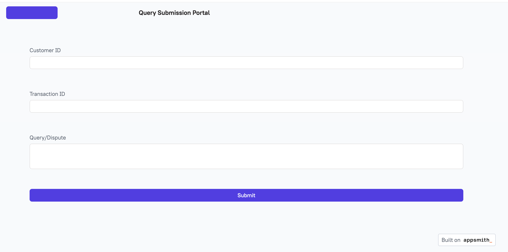
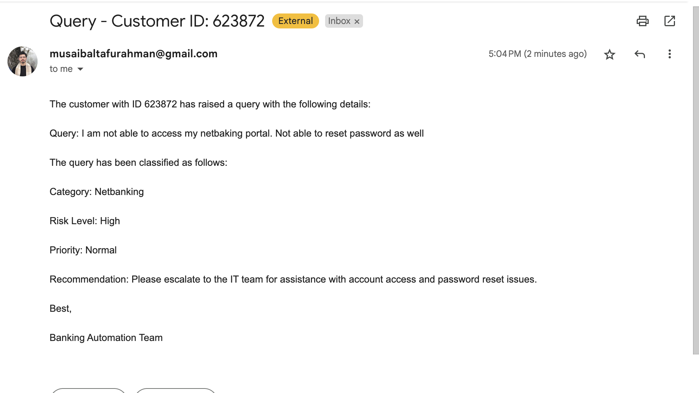

# Link to access the plaform: https://app.appsmith.com/app/query-submission-portal/page1-67e8377bd45638123b55f111

# Thought process and the flow explanation

As per the requirement, the task was to build a platform, that can collect disputes realated to banking and do the following:

<ul>
<li> Collect the information over an API </li>
<li> Classify the dispute and identify the risk</li>
<li> Identify the priority of the issue based on customer history </li>
<li> Route the issue to the specific team </li>
<li> Send a response as well to the request </li>
</ul>

Demo Video Link: https://www.loom.com/share/b12556d5f4be42d8bbd09a22bb53bde3    
UI Link: https://app.appsmith.com/app/query-submission-portal/page1-67e8377bd45638123b55f111    
<strong> Since the backend is deployed on a free Render instance, it might take a little longer than expected to get the API response </strong>

So, my thought process to build the solution started with capturing the user requirements.  
-> So, we first need an API endpoint, where the required data can be submitted.  
-> Secondly, we need to classify the dispute, for which we'd need an LLM to process the issue, which would most of the times be in natural language. So, we can use Gemini (gemini-1.5-flash) to classify the dispute based on standard banking query classes like Cards, Cheques, Account related etc. 
->After classifying the query, we need to analyse the priority, for which we'd need to store the customer history somewhere, so the next thing is to add a database, for which MongoDB can be used.
-> Since, history can be of multiple types, what we can do is to keep a track of the queries submitted by a customer. If a query for a specific transaction number comes more than thrice, then it is a high priority issue. If more than twice and less or equal to thrice, then a medium issue, else a low priority one.
-> One more thing, that I missed was flagging risk. Some queries like losing a debit card or maybe netbanking credential issue are high risk issues, so need to be flagged. So, in order to cater to this requirement, we, along with classifying a query, can also use the LLM to determine the risk based on standard banking terminologies. So, the classification layer, can return the query classification and also the risk level.
-> Further, one more LLM layer is required to come up with a suggested approach for the concerned support team, so that they can timely process the request. So, using the same gemini-1.5-flash, we can generate recommendations based on the user query and the classification generated.
--> Finally, the issue has to be notified to the concerned team, for which we can setup email notifications in the earlier versions and can go for better notification channels afterwards.

# Tech Stack Used

<ul>
<li> Python - Flask </li>
<li> Gemini (gemini-1.5-flash)</li>
<li> MongoDB </li>
</ul>

Final flow looks like following.

  

# If an AI-assisted or low code tool is available  

So, if AI-assisted or low-code tools are available, the development can be accelerated to a pretty good extent. I tried using GlideApps, but it had limitted options in the free tier, so I have used AppSmith to build the UI of the application. If AppSmith like tools are available, we don't have to worry much about the UI development, API integration and all. All that can be handled by low code tools that provide drag and drop options for UI development and seamless and minimal code API integration. This way, we can focus on the core business logic and the Gen AI part and not worry about the backend.

# Future enhacements

So, as far as future enhancements are concerned, we can extened this tool to reduce manual work for the teams to go and check the systems for the disputes caused. For e.g if there is a transaction that has been processed, but the beneficiary claims non-receipt of funds, the AI tools can be used to call some functions to access source system APIs securely to analyse the problem. To do this, we might have the complexity of masking PII data, but that isn't a problem that can't be solved. What I can think of is implementing Langchain's agentic tools, we can scan source systems for data, find the cause of the problem and respond to the customer immediately and accrurately.   Furthermore, the recpmmendations right now are very generic. We can finetune the LLMs over custom banking data that would have the issues and the recommnended solutions, so that the recommendations are very well tailored and personalized.

